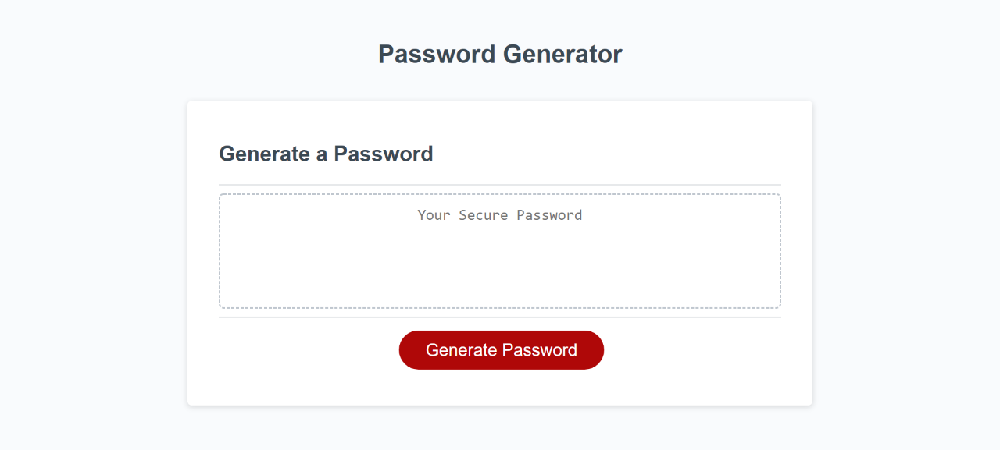

# Password-Generator

## Description

*My motivation in completing this project was to be able to apply all the concepts I had learned in class to a real world random password generator application. 

*I built this project because I wanted to test my skills and see how my stategy would work out in practice. 

*The problem solved while working on this project was making the code decide on a random assortment of a given length. 

*Through this project I learned a lot about how to decide on a strategy and to think simply. 

*I faced challenges with finding a strategy that I could work through start to finish. I had several rough drafts and tests. Eventually, I took a hint from the instructor during class & the TA, Jake. With a more simple strategy, my code was much more straight forward and clean. I faced a challenge with placement for my conditional variables to concatenate if true in an empty string. I also faced a challenge with how my for loop should look with my math.random function. AskBCS helped me out a lot. 

## Website Appearance

## Link to Deployed Application:
https://srandall1213.github.io/Password-Generator/